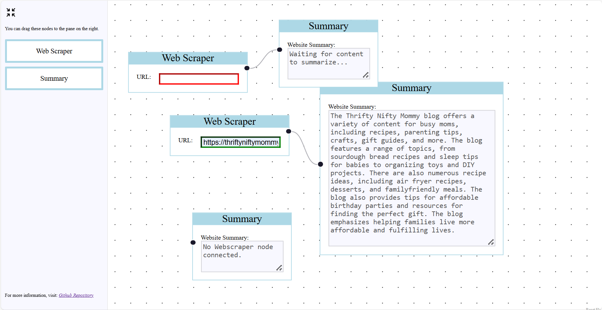

# Web Scraping Application with Drag-and-Drop Node Interface

## Project Overview
This is a web application that allows users to scrape data from websites and generate summaries through an intuitive drag-and-drop interface. Users can add two types of nodes to the canvas:
- **Web Scraping Node**: Allows users to input a URL to scrape content from.
- **Summary Node**: Outputs a summary of the scraped content using the Gemini API when connected to a Web Scraping Node.

The application is built using Flask for the backend and React for the frontend, with web scraping powered by BeautifulSoup and the Gemini API handling text summarization.

## Technologies Used
- **Backend**: Flask, BeautifulSoup
- **Frontend**: React, React Flow (for drag-and-drop functionality)
- **API**: Gemini API (for summarizing scraped data)
- **Deployment**: Vercel

## Key Features
- Drag-and-drop interface using **React Flow**
- Real-time web scraping and summary generation
- Integration with external APIs (Gemini API for summarization)

## Obstacles Encountered
- **Learning React Flow**: As this was my first time using React Flow, it required some time to explore its documentation and features.
- **Setting up communication between nodes**: Establishing communication between the custom nodes (Web Scraping and Summary nodes) was challenging and required a good understanding of React Flow custom hooks. 
   - I used `useHandleConnections` in both nodes to manage connections, and implemented `onConnect` and `onDisconnect` callbacks.
   - In the Summary Node, when a connection is established, the `onConnect` callback sets a state variable with the source node's ID. I use the `useNodesData` hook on the source node's ID to access the node's `data` prop. When this hook updates, it triggers an update using `useEffect` passing a function to the source node's `data` prop which can be later used for cross-node communication.
   - The Web Scraping Node checks for this function and, if available, uses it to pass the scraped information through to the summary node. The `onDisconnect` callback resets the communication channel by removing the mentioned function from the `data` object.

## App Preview

## Deployed Application
You can access the live application here: [Web-Scraper](https://web-scraper-weld-tau.vercel.app/)
